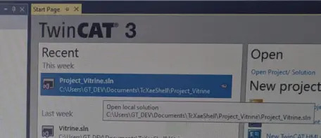
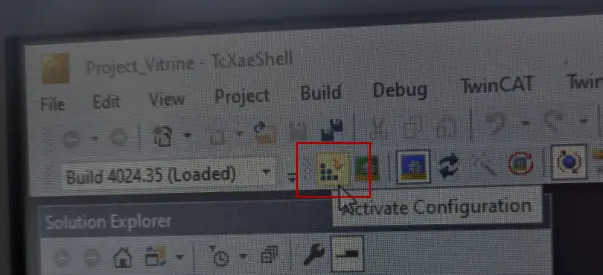
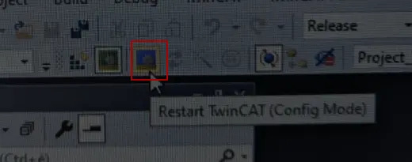

# Vitrine 2025

## Maintenance de la vitrine

### Redémarrer / éteindre le serveur python  (ce projet)

Afin d'empêcher d'avoir des signaux allumés, le endpoint `/clean-all-unsafe` peut être appelé avant d'arrêter le serveur. Cet endpoint effectue les actions suivantes :
- Écrit `False` sur tous les offset : **le robot fini l'action en cours, puis ne bouge plus**.
- Remet les états à zéro : enlève toutes les valeurs du tableau `BUILDINGS_PLACED` et change la valeur de `ROBOT_IS_MOVING` à `False`. Cela indique au serveur que la vitrine est dans son état de départ.

```bash
# Depuis la ligne de commande (Powershell / Bash)
curl http://172.22.22.10:8000/clean-all-unsafe
```

### Redémarrer le projet sur le PLC depuis le mini PC

1 - Allumez le PLC

2 - Allumez le mini PC (c'est lui qui contrôle le PLC)

3 - Sur le mini PC, ouvrez le logiciel TcXaeShell (icône jaune dans la barre de menu) :


4 - Ouvrez le projet "Projet_Vitrine.sln" :



5 - Cliquez sur le bouton "Activate Configuration" : 



Appuyez sur OK à chaque popup.

6 - Cliquez sur "Restart TwinCAT (Config Mode)" :



Appuyez sur OK à chaque popup.

7 - ???

8 - PROFIT

## Interrupteurs Tasmota

| Numéro | Adresse IP (réseau de l'Antenne) | Adresse MAC       |
|--------|----------------------------------|-------------------|
| 1      | 172.22.22.11                     | 2c:bc:bb:d5:ec:18 |
| 2      | 172.22.22.12                     | 2c:bc:bb:d5:b5:ac |
| 3      | 172.22.22.13                     | 2c:bc:bb:d7:6d:cc |
| 4      | 172.22.22.14                     | 2c:bc:bb:d5:cc:64 |

Allumer un interrupteur: `<adresse_ip>/cm?cmnd=Power%20On`

Éteindre un interrupteur: `<adresse_ip>/cm?cmnd=Power%20Off`

Basculer on/off un interrupteur: `<adresse_ip>/cm?cmnd=Power%20TOGGLE`